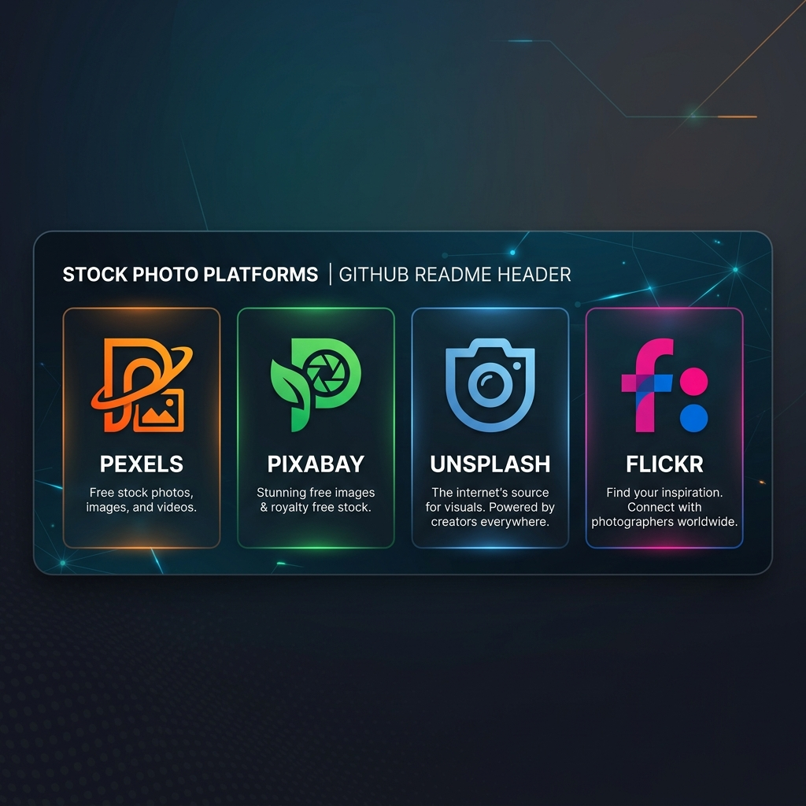

<p align="center">
  
</p>

# Stock Fetcher

Stock Fetcher is a standalone, lightweight Python library for fetching copyright-free images and photos from various popular sources such as Pexels, Pixabay, Unsplash, and Flickr.

Built with a clean architecture and type hints, it makes retrieving high-quality stock images across multiple providers simple and consistent.

## Features

- **Unified Interface:** Fetch images using a consistent API regardless of the backend source.
- **Multiple Providers:** Out-of-the-box support for Pexels, Pixabay, Unsplash, and Flickr.
- **Type Hinting:** Fully type-hinted for better IDE integration.
- **Error Handling:** Standardized `FetcherError` wrapper for easy debugging and exception catching.

<p align="center">
  
</p>

<p align="center">
  <a href="https://opensource.org/licenses/Apache-2.0">
    
  </a>
  <a href="https://www.python.org/downloads/">
    
  </a>
  <a href="https://github.com/astral-sh/ruff">
    
  </a>
  <a href="https://modelcontextprotocol.io/">
    
  </a>
</p>

## Installation

You can install the core package directly from the source directory:

```bash
pip install .
```

### Optional Features (Extras)

Stock Fetcher supports CLI and MCP integrations as optional features. You can install them by adding extras:

- **CLI Support:** To use the command-line interface, install with `cli`:
  ```bash
  pip install '.[cli]'
  ```
  👉 **Read the [CLI Manual](docs/cli_manual.md) for detailed usage and commands.**

- **MCP Server:** To expose this package as a tool for AI agents (like Claude), install with `mcp`:
  ```bash
  pip install '.[mcp]'
  ```
  👉 **Read the [MCP Manual](docs/mcp_manual.md) for Claude configuration instructions.**
- **Install All:** To install both features at once:
  ```bash
  pip install '.[all]'
  ```

## Quick Start

Import the client for the platform you want to use. You must provide an API key for Pexels, Pixabay, and Unsplash. (Flickr uses a custom scrapper and does not require an API key in this implementation).

### Using Pixabay

```python
from stock_fetcher import PixabayClient, FetcherError

client = PixabayClient(api_key="YOUR_PIXABAY_API_KEY")

try:
    images = client.search_images(query="nature", per_page=5)
    for img in images:
        print(f"[{img['source']}] Original URL: {img['url_original']}")
except FetcherError as e:
    print(f"Error: {e}")
```

### Using Unsplash

```python
from stock_fetcher import UnsplashClient, FetcherError

client = UnsplashClient(api_key="YOUR_UNSPLASH_ACCESS_KEY")

try:
    images = client.search_images(query="architecture", per_page=3)
    for img in images:
        print(f"[{img['source']}] ID: {img['id']} - URL: {img['url_original']}")
except FetcherError as e:
    print(f"Error: {e}")
```

### Using Pexels

```python
from stock_fetcher import PexelsClient

client = PexelsClient(api_key="YOUR_PEXELS_API_KEY")
images = client.search_images(query="technology", per_page=3)
```

### Using Flickr

```python
from stock_fetcher import FlickrClient

client = FlickrClient() # No API key required for the scrapper
images = client.search_images(query="vintage cars", per_page=5)
```

## Disclaimer & Licensing

> [!WARNING]
> **Copyright & Usage Notice**
> While this library fetches images from platforms known for providing "royalty-free" or "copyright-free" content, **you are solely responsible for ensuring that your specific use-case complies with the respective platform's licensing terms.**
>
> - **Pexels / Pixabay / Unsplash**: Generally allow free commercial and non-commercial use, but strictly prohibit selling unaltered copies, building competing services, or using identifiable people/trademarks in an offensive manner.
> - **Flickr**: Images are governed by various Creative Commons licenses. This library attempts to filter for permissive licenses, but you **must** manually verify the exact license of the image before any commercial use.
>
> The authors and maintainers of `stock-fetcher` assume no liability for any copyright infringement, trademark disputes, or legal issues that may arise from using the fetched images. Always refer to the original image source link (`url_page`) to review the precise license details.

## Error Handling

The library provides a custom `FetcherError` exception to handle API failures uniformly.

```python
from stock_fetcher import PexelsClient, FetcherError

client = PexelsClient(api_key="INVALID_KEY")

try:
    client.search_images("test")
except FetcherError as e:
    print(f"A fetching error occurred: {e}")
```
